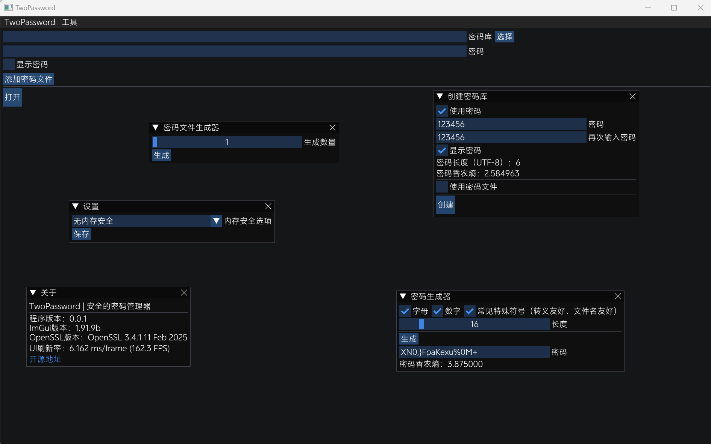

# TwoPassword | 安全的密码管理器

为了安全保存密码，我们基于TPCS标准（见下文）创建了这个极其安全的密码管理工具




在创建密码库时，建议使用中文、英文、数字、全角符号、半角符号混合的强密码（例如某句易记的名人名言）

如果你要修改代码，请一定注意字符编码（ImGui使用UTF-8，WinAPI使用UTF-16，TPCS3使用UTF-32）

# 内存安全问题

密钥被派生后会在内存中常驻，无法抵抗冷启动攻击或其他内存分析攻击，为此，我们在设置中提供了三个内存安全选项
- 无内存安全（不考虑内存安全，仅在可控环境中使用此选项）
- 灵活（程序关闭时会启动外部程序SafeMemoryCleaner进行内存清理工作）
- 严格（程序不会进行内存释放，请参阅[无内存释放（实验性功能）](#无内存释放（实验性功能）)）

你也许可以对程序添加一些保护壳（比如VMP、TMD之类的），以增大内存分析的难度

## SafeMemoryCleaner工作原理

SafeMemoryCleaner会扫描所有可写内存区段（主要是堆区和栈区，这些地方非常敏感），并使用`DoD 5220.22-M`方法对其进行安全擦除

- 写0
- 写1
- 写随机
- 写0
- 写0
- 写1
- 写随机

# 无内存释放（实验性功能）

内存一旦被释放其中的敏感数据就不可控了，所以程序在启动时会Hook以下API调用

- HeapFree
- VirtualFree
- GlobalFree
- LocalFree
- free（CRT）
- VirtualFreeEx
- HeapDestroy
- CoTaskMemFree
- LocalFree
- SysFreeString
- RtlFreeHeap
- RtlDestroyHeap

使其直接返回而不进行内存释放，让敏感数据始终保持在程序的堆区，并在退出时使用SafeMemoryCleaner清理

这种方式激进又相当危险，所以是“实验性功能”

非常不建议使用这个模式，由于ARGON2D非常消耗内存，随便保存几下内存就严重泄露了，而且SafeMemoryCleaner效率非常之低，程序关闭后还要在后台恶心你一段时间（笑


# 其他安全问题

程序在解析密码库时可能存在缓冲区溢出或越界读写等问题（只是可能）

编译程序时建议开启ASLR和Stack Canary功能，能多少缓解一些风险。同时，不建议打开来路不明的密码库（对你好也是对他人好）

# TODO/FIXME

（长度溢出感觉没必要修复，我不相信有人有21亿条密码需要存储，笑）

- WinAPI读取/写入大文件长度溢出
- OpenSSL ASN.1解析器的长度溢出
- 内存安全问题：敏感数据清理不彻底，敏感数据停留时间过长
- 把指针和句柄都换成智能指针和智能句柄避免资源泄露
- SafeMemoryCleaner多线程清理，RESERVED属性清理，文件缓存清理，进程工作集清理，全系统内存清理
- 浏览器密码导入

# TPCS标准

TPCS（Two Password Cryptography Standards）是我们实现安全密码保存的标准栈

TPCS的所有结构体均以**4字节对齐**，时间戳均为**秒级UTC时间**

## TPCS1 对称加密标准

TPCS1使用`AES-256-GCM`与`CHACHA20-POLY1305`双加密算法，是一种**认证加密**模式（AEAD），同时提供加密和完整性验证。同时也是一种**无头加密**模式（密文数据不包含任何可识别特征，对外仅表现为随机的二进制流）

```C++
constexpr uint8_t tpcs_magic[3] = { 't', 'p', 'c' };

constexpr uint8_t version_tpcs1 = 1;
constexpr size_t sizeof_tpcs1_header = 40;
constexpr size_t sizeof_iv = 12;
constexpr size_t sizeof_authtag = 16;
constexpr size_t least_tpcs1_size = sizeof_iv + sizeof_authtag + sizeof_tpcs1_header + 1;
struct tpcs1_header {
    uint8_t magic[3];
    uint8_t version;
    // chacha20的iv
    uint8_t chacha20_iv[12];
    // poly1305的验证标签
    uint8_t poly1305_authtag[16];
    // 数据长度
    uint64_t data_size;
    // chacha20加密后的数据
    // uint8_t chacha20_encrypted_data[data_size];
};
```

数据首先使用`CHACHA20-POLY1305`加密，然后使用`AES-256-GCM`对TPCS1头和数据再进行一次加密（对TPCS1头进行加密主要为了抹除特征），并将IV和验证标签附加到密文数据开头

```C++
struct tpcs1_cipher_block
{
    // AES的iv
    uint8_t aes_iv[12];
    // GCM的验证标签
    uint8_t gcm_authtag[16];
    // 加密的TPCS1头和数据
    // ...
};
```

如果你想获取更多关于无头加密的信息，请参阅[关于无头加密（无结构加密）](#关于无头加密（无结构加密）)）

## TPCS2 SafeKDF密钥派生标准

用户输入的密码及密码文件被TPCS3编码（见后文），使用
- `PBKDF-SHA512`（60万次迭代，派生到256字节）
- `PBKDF-SHA3-512`（60万次迭代，派生到128字节）
- `ARGON2D`（10次迭代，2GiB内存用量，4并行，派生到64字节）
将TPCS3编码派生到64字节，用于TPCS1对称加密

三次派生都使用不同的16字节随机生成的盐

```C++
constexpr size_t sizeof_tpcs2_header = 48;
constexpr size_t least_tpcs2_size = sizeof_tpcs2_header + least_tpcs1_size;
struct tpcs2_header {
    uint8_t salt[48];
    // 加密后的TPCS1数据
    // ...
};
```

## TPCS3 密码及密码文件编码标准

密码编码基于UTF-32

```C++
constexpr size_t sizeof_tpcs3_encoded_char = 8;
struct tpcs3_encoded_char {
	// 从0开始递增的ID，溢出了无所谓
	uint32_t id;
	// 字符的utf32编码，从小端开始，大端小端交替轮换
	uint32_t utf32;
};
```

密码文件是顺序敏感的，取其前8 KiB，跟随在编码后的密码后

哪怕密码文件小于8 KiB，也要分配完整的8 KiB内存，下一个密码文件紧接上一个密码文件，最后的空缺部分用0填充

## TPCS4 密码库存储标准

密码库的存储结构使用ASN.1（相比于json或其他存储结构，ASN.1更接近底层，内存安全方面的可控性更高）

```ASN.1
PasswordRecord ::= SEQUENCE {
    website UTF8String,
    username UTF8String,
    password UTF8String,
    description UTF8String OPTIONAL,
    common_name UTF8String OPTIONAL
}

PasswordLibrary ::= SEQUENCE {
    create_time INTEGER,
    update_time INTEGER,
    records SEQUENCE OF PasswordRecord
}
```

# 关于无头加密（无结构加密）

如你所见，TPCS1的设计就是无头加密：密文数据不包含任何文件头或结构，也就是没有任何特征，他人在不知道密钥的情况下就和普通的随机数无异，极大地增加了取证和分析的难度

不过需要特别注意的，密文长度总是整倍数也可以算是一种特征，TPCS1使用的是流式加密模式，不需要填充，所以从根源上就杜绝了密文长度分析
